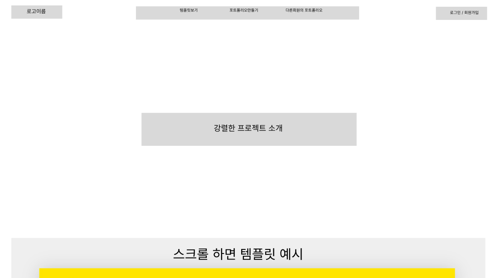
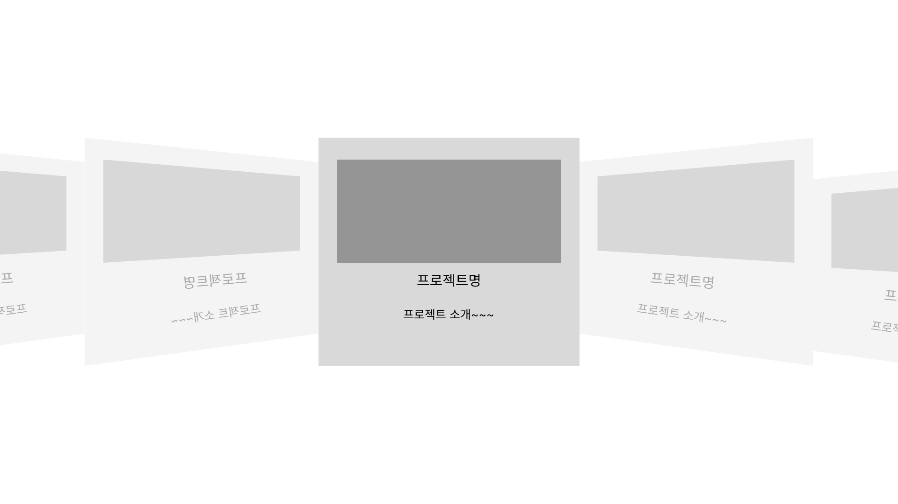
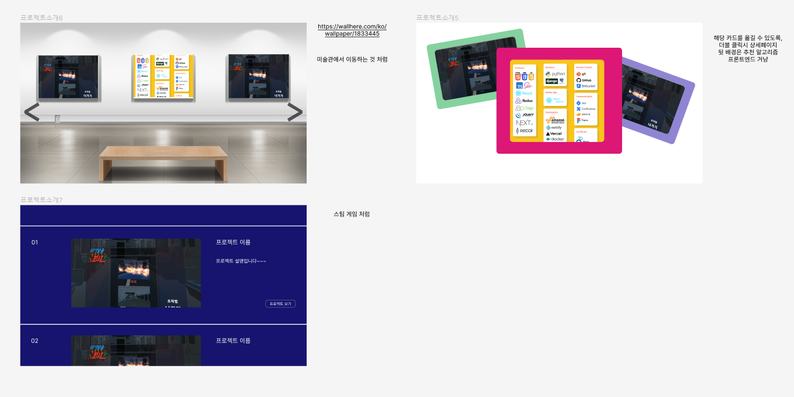
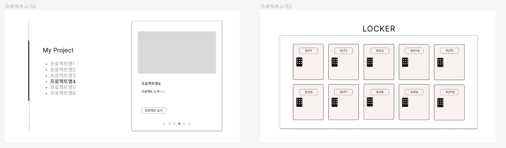
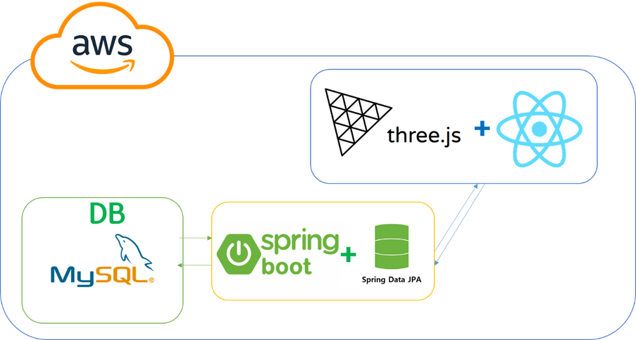
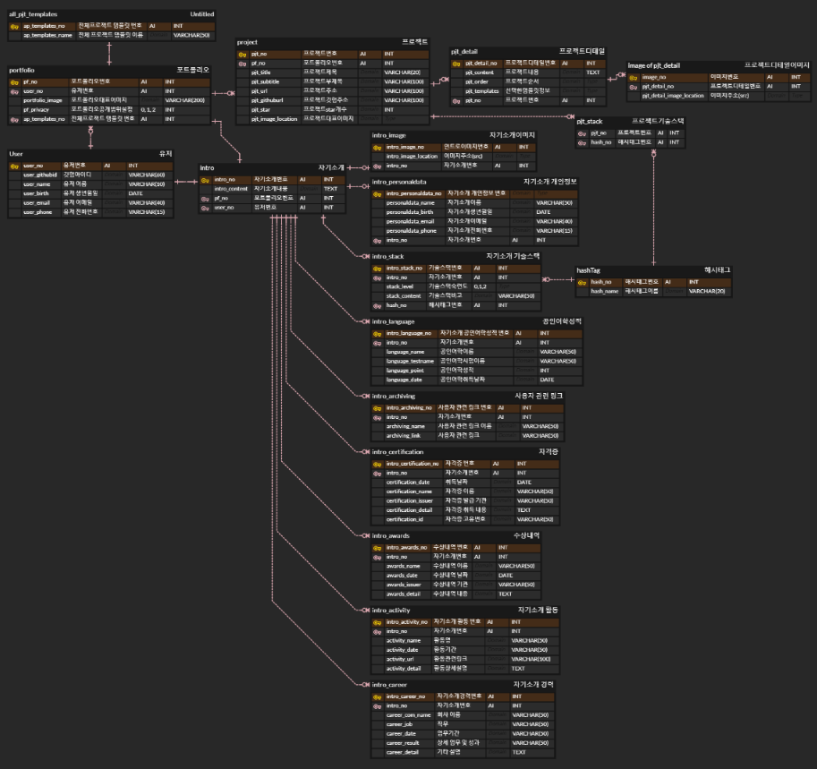
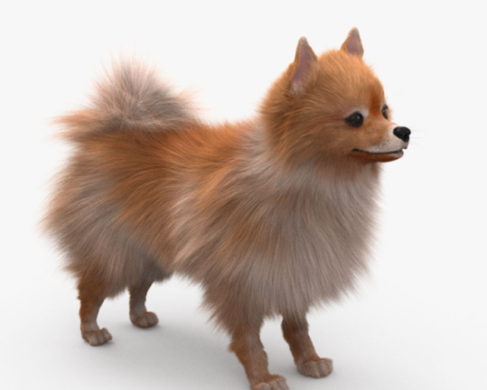
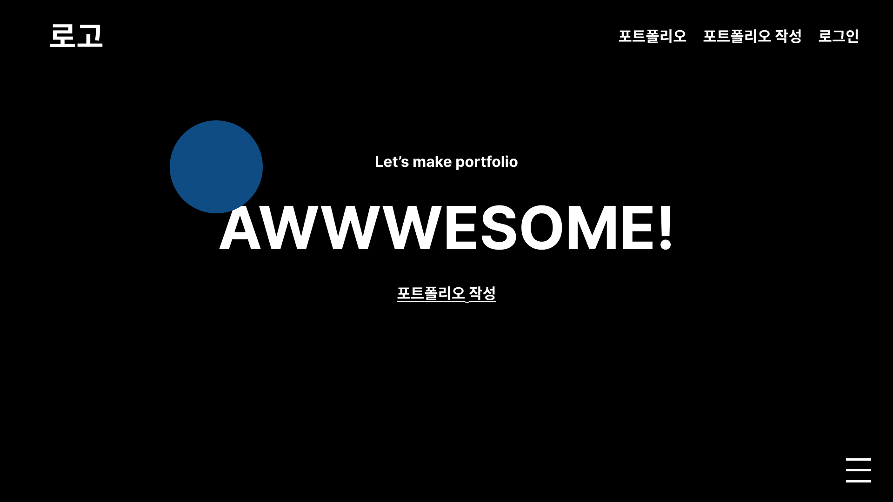
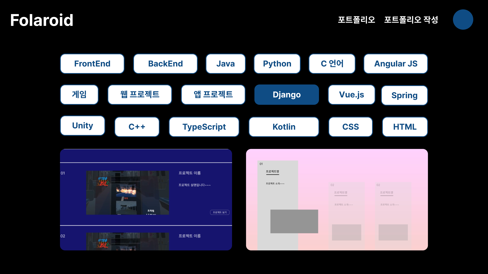

# README

### :airplane: 1. 아이디어 회의

    1) 기업, 프로젝트 마스코트를 그려주는 AI 서비스
    * 키워드 입력으로 관련된 마스코트 및 캐릭터를 자동으로 생성
    
    2) 그림 생성해서 릴레이 소설
    * 갈틱폰 형식으로 이전 사람의 글을 보고 다음 스토리 작성
    * 같이 소설 써서 공유 & 다운로드까지 할 수 있는 기능
    
    3) 반려 식물 키우기 게임
    * 요즘 트렌드인 반려식물 이슈
    * 직접 농업에 대한 지식을 배울 수 있는 효과
    
    4) 포트폴리오 자동 작성 서비스
    * 깃헙 프로젝트에 양식에 맞게 readme 파일을 작성하고 공유하면 해당 파일을 크롤링하여 포트폴리오 사이트를 제작 
    * 타인의 포트폴리오를 볼 수 있는 서비스 및 다양한 서브 기능들을 인터렉티브 웹 기술 활용하여 다양한 디자인으로 제공
    
    5) 주류 판매 및 칵테일 서비스
    * 쿠팡이나 마켓컬리 등 주류를 판매하는 사이트가 존재하지 않음.
    * 성인 인증을 통하여 주류를 구매, 배달받을 수 있는 사이트와 더불어 칵테일에 대한 소개를 해주는 서비스 고안
    * 주류의 인터넷 판매는 전통주를 제외하고 불법일 수 있다.(기각)

## 포트폴리오 자동 작성 서비스

### 프로젝트명 : 폴라로이드(Folaroid)
>
> 포트폴리오 자동 디자인 서비스.
>
> 깃헙 프로젝트에 양식에 맞게 readme 파일을 작성하고 공유하면 해당 파일을 크롤링하여 데이터를 저장하고 해당 데이터를 기반으로 개인별 포트폴리오 사이트를 제작
>
> WebGL로 구현된 캐릭터가 타인의 포트폴리오를 볼 수 있는 서비스 및 다양한 서브 기능들을 인터렉티브 웹 기술 활용하여 다양한 디자인으로 제공

### 기술 활용 기획
- 백엔드 : Spring, Java, MySQL, python
- 프론트엔드 : React, Three.js

### 담당파트
- 백엔드 : 김지훈, 박종선, 이창현
- 프론트엔드 : 김용환, 김미애, 정예원

### :monorail: 2. 화면 기획 - 프로토타입

##### 메인페이지

##### 템플릿 페이지

+ 템플릿 디자인 추가

### :classical_building: 3. 아키텍처 다이어그램

##### Three.js | React | Spring boot | JPA | MySQL | AWS

### :pencil: 4. 기능명세서

| 기능                        | 내용                                                         | 비고 | 참고사이트 |
| :-------------------------: | :----------------------------------------------------------: | :--: | :--------: |
| 회원 관리                   | 깃허브 연동 로그인, 회원가입                                 |      |            |
| 메인 페이지                 | 서비스 소개 - 다양한 템플릿 사용 방법  /  로그인페이지 이동  |      |            |
| 제작시 제공되는 템플릿      | 될 수 있는한 많이 제작 (10개 이상)  색상은 사용자의 프로젝트 이미지와 연관지어서 생성하거나 커스터마이징 가능하게 구현  |      |            |
| 다른 회원의 포트폴리오 조회 | 해시태그 활용 - 기술스택기준 / FE BE 등  해당 태그가 적용된 모든 포트폴리오 제공  최신순 / 조회순으로 정렬 |      |            |
| 마이페이지                             | 자신의 포트폴리오를 모아서 볼 수 있게(제작 및 관리)                                                              |      |            |
| 제작 페이지                             | 제작 페이지 입장 시 자동으로 크롤링 진행 1단계 프로젝트 디자인 선택 ⇒ 프로젝트 대표 이미지 넣으면 분석을 통하여 가장 지배적인 색상 두가지를 추출, 그라데이션으로 배경 적용. 커스터마이징 가능.  2단계 (프로젝트 상세) 배치에 대해 사용자가 커스타마이징 가능하도록  개인소개 + 기술스택 + 프로젝트소개 | 유저 entity에 추가해야할 것: 디자인, 이미지 배치 위치 등으로 유저가 선택한 항목 각각을 저장하는 field 필요. ⇒ 개인정보에 관한 내용 컨설팅 요청| 아이콘 :  https://simpleicons.org/?q=python 색상 추출 : https://gogetem.tistory.com/entry/Python-이미지에서-주요-색상-추출하기-colorthief           |
| 제작시 이미지                            | 깃허브에서 크롤링된 이미지를 쌓아두고, 사용자가 사진을 추가할 수 있도록 한다. 이미지를 넣을 때는 팝업창에 이미지를 선택할 수 있게 한다.                                                             | 크롤링한 이미지를 유저 entity에 저장, 이미지를 선택하는 곳에서 불러오기, 이미지를 추가하는 곳을 통해 entity에 추가할 수 있음.     |            |
| 제작 완료 후                 | 공개 여부 선택한 후 저장 => 해쉬태그 설정 => URL 제공  (페이스북, 카카오톡 클릭시 공유)          | 1. 전체 공개(URL + 다른 회원의 포트폴리오를 볼 수 있음) 2. 부분 공개(URL)  3. 비공개      |            |
| 추가) 기업 추천              |작성한 기술스택을 기반으로 기업 추천                             |구인구직 사이트 크롤링      |            |
| 튜토리얼 페이지              |WebGL 활용 제작 페이지에서 각 선택 상황에서 어떤식으로 사용하는지 튜토리얼 제공|      |            |

### :airplane: 5. 팀미팅(221017)

    1) 사용자가 디자인할 수 있는 기능이 한정적임 -> 템플릿의 수량보다 다양한 케이스를 지원할 수 있는 기능이 중요하다!
    2) 자기소개 템플릿과 프로젝트 소개 템플릿을 SelectBox or radio로 선택, 조합할 수 있도록 한다.

### 6.ERD

*추가해야할 부분*

자기소개

- ARCHIVING, 링크: github, linkedin, blog
- 개인 정보: 이름, 생년월일, 주소지, 연락처, 이메일, 학력 등
- 경력
- 기술스택

프로젝트

- 기술스택
- star 개수
- github 주소
- url

### 7. 캐릭터 모델링 후보
 
https://www.turbosquid.com/ko/3d-models/rigged-cute-cartoon-chibi-rabbit-3d-1759274 
 
https://www.turbosquid.com/ko/3d-models/cute-cartoon-flamingo-3d-model-1322940 
 
https://www.turbosquid.com/ko/3d-models/3d-cute-cartoon-bee-1807380

### 8. 화면 설계

1. 메인페이지

2. 제작 첫페이지

3. 다른회원의 포트폴리오

### :pencil: 8. REST API Docs

| Description | URL (endpoints) |  Method | Body | Payload | 상태 | ps |
| :---------: | :-------------: |  :----: | :--: | :-----: | :--: | :-: |
| 마이페이지   |                 |         |      | return{  } | | |
| 포트폴리오 제작 |              | POST | user_no, pf_privacy, image | pf_no | |
| 제작 첫페이지 | | GET | pf_no | return { pjt_no, pjt_name, pjt_subtitle, pjt_url, pjt_githuburl, pjt_star } | |
| 제작 첫페이지 - 템플릿 변경 | | PUT | pf_no, ap_templates_no | pf_no | |
| 제작 첫페이지 - 프로젝트 생성 | | POST | pjt_githuburl | pjt_no | | |
| 프로젝트 생성 - 공개 레포지토리 검색 | | GET | user_githubid | pjt_githuburl | | |
