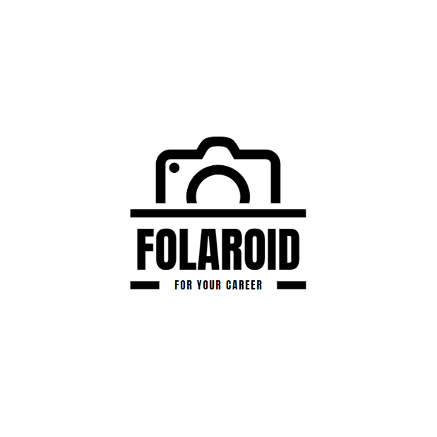
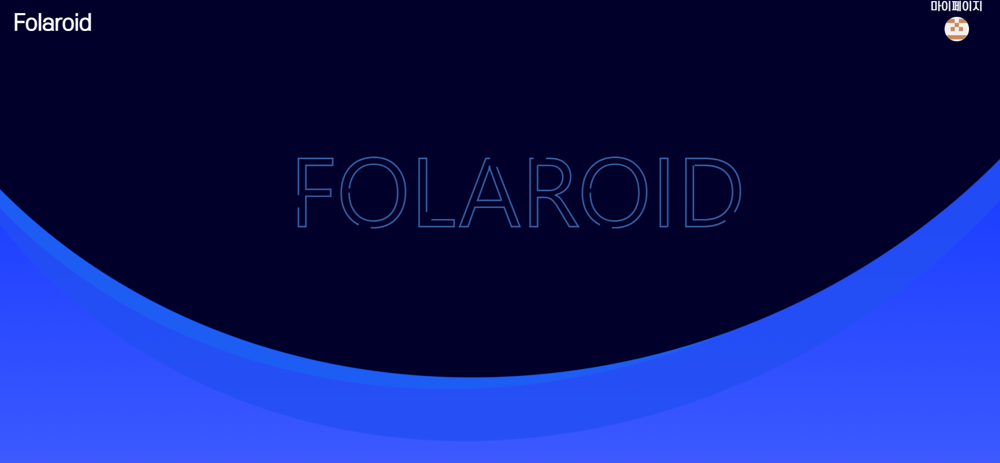
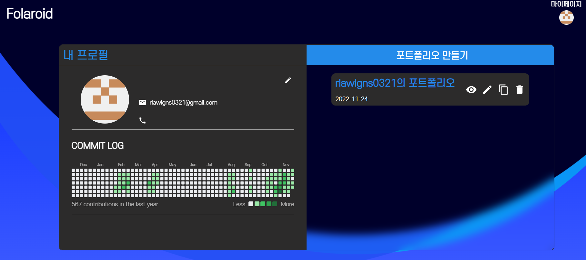
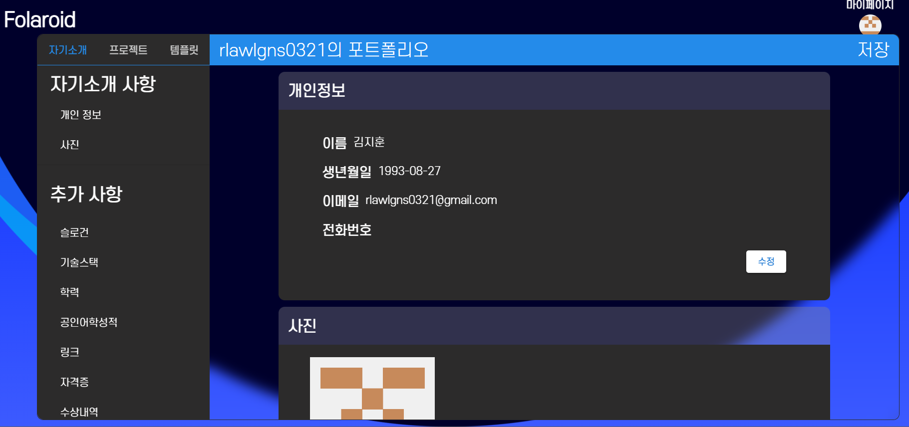
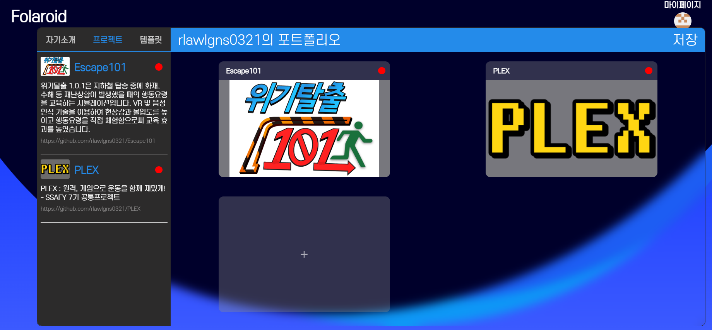
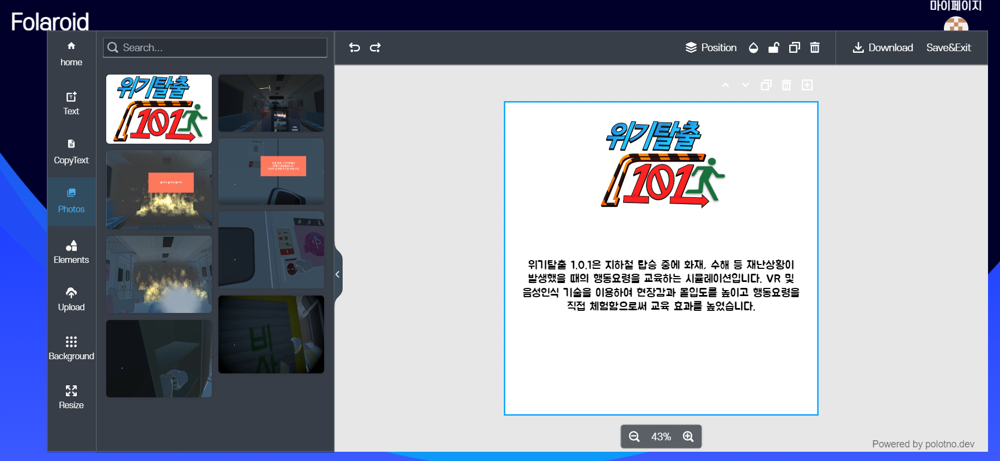
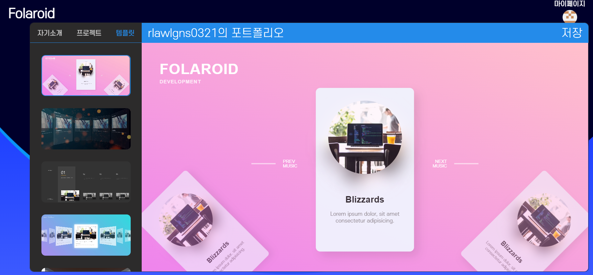
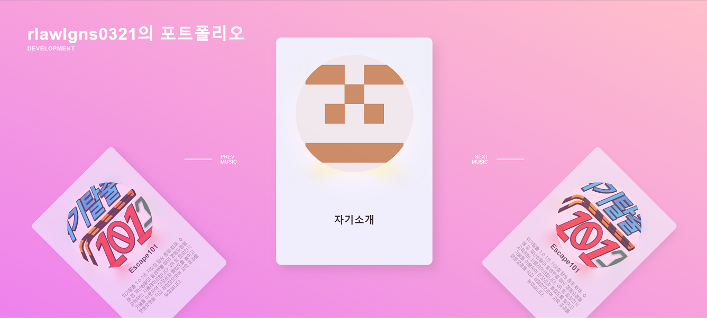
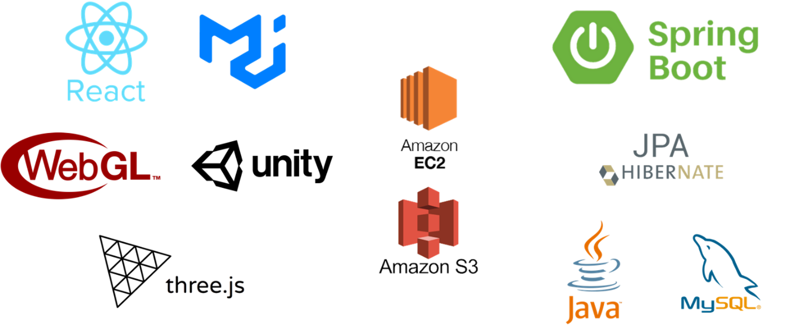

## :camera: 폴라로이드 소개

폴라로이드(Folaroid)는 개발자들이 인상적인 포트폴리오 디자인을 쉽게 하도록 도와주는 디자인 서비스입니다. 개발자를 위한 기능과 깃허브와의 연동, 그리고 다양한 형태의 템플릿을 제공하여 개발자 모두가 자신만의 개성있는 포트폴리오를 편리하게 작성할 수 있습니다.

## 📸 서비스 화면

### 메인화면

### 마이페이지 화면

### 자기소개 작성화면

### 포트폴리오에 삽입할 프로젝트 등록 화면

### 프로젝트 편집 화면

### 템플릿 선택 화면

### 만들어진 포트폴리오 화면

### 기술 활용 기획
- 백엔드 : Spring, Java, MySQL, python
- 프론트엔드 : React, Three.js

### :pencil: 기능명세서

| 기능                        | 내용                                                         | 비고 | 참고사이트 |
| :-------------------------: | :----------------------------------------------------------: | :--: | :--------: |
| 회원 관리                   | 깃허브 연동 로그인, 회원가입                                 |      |            |
| 메인 페이지                 | 서비스 소개 - 다양한 템플릿 사용 방법  /  로그인페이지 이동  |      |            |
| 제작시 제공되는 템플릿      | WebGL로 제작  색상은 사용자의 프로젝트 이미지와 연관지어서 생성하거나 커스터마이징 가능하게 구현  |      |            |
| 다른 회원의 포트폴리오 조회 | 해시태그 활용 - 기술스택기준 / FE BE 등  해당 태그가 적용된 모든 포트폴리오 제공  최신순 / 조회순으로 정렬 |      |            |
| 마이페이지                             | 자신의 포트폴리오를 모아서 볼 수 있게(제작 및 관리)                                                              |      |            |
| 제작 페이지                             | 제작 페이지 입장 시 자동으로 크롤링 진행 1단계 프로젝트 디자인 선택 ⇒ 프로젝트 대표 이미지 넣으면 분석을 통하여 가장 지배적인 색상 두가지를 추출, 그라데이션으로 배경 적용. 커스터마이징 가능.  2단계 (프로젝트 상세) 배치에 대해 사용자가 커스타마이징 가능하도록  개인소개 + 기술스택 + 프로젝트소개 | 유저 entity에 추가해야할 것: 디자인, 이미지 배치 위치 등으로 유저가 선택한 항목 각각을 저장하는 field 필요. ⇒ 개인정보에 관한 내용 컨설팅 요청| 아이콘 :  https://simpleicons.org/?q=python 색상 추출 : https://gogetem.tistory.com/entry/Python-이미지에서-주요-색상-추출하기-colorthief           |
| 제작시 이미지                            | 깃허브에서 크롤링된 이미지를 쌓아두고, 사용자가 사진을 추가할 수 있도록 한다. 이미지를 넣을 때는 팝업창에 이미지를 선택할 수 있게 한다.                                                             | 크롤링한 이미지를 유저 entity에 저장, 이미지를 선택하는 곳에서 불러오기, 이미지를 추가하는 곳을 통해 entity에 추가할 수 있음.     |            |
| 제작 완료 후                 | 공개 여부 선택한 후 저장 => 해쉬태그 설정 => URL 제공  (페이스북, 카카오톡 클릭시 공유)          | 1. 전체 공개(URL + 다른 회원의 포트폴리오를 볼 수 있음) 2. 부분 공개(URL)  3. 비공개      |            |
| 추가) 기업 추천              |작성한 기술스택을 기반으로 기업 추천                             |구인구직 사이트 크롤링      |            |
| 튜토리얼 페이지              |WebGL 활용 제작 페이지에서 각 선택 상황에서 어떤식으로 사용하는지 튜토리얼 제공|      |            |

### :pencil: ERD

### 아키텍쳐

### 🦾 기술스택

### 담당파트
- 백엔드 : 김지훈, 박종선, 이창현
- 프론트엔드 : 김용환, 김미애, 정예원

