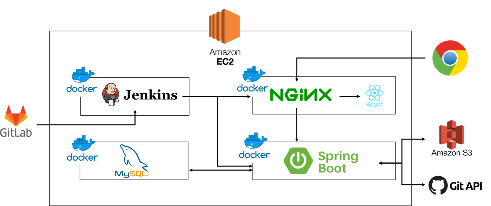

## :camera: 폴라로이드 소개

폴라로이드(Folaroid)는 개발자들이 인상적인 포트폴리오 디자인을 쉽게 하도록 도와주는 디자인 서비스입니다. 개발자를 위한 기능과 깃허브와의 연동, 그리고 다양한 형태의 템플릿을 제공하여 개발자 모두가 자신만의 개성있는 포트폴리오를 편리하게 작성할 수 있습니다.

## 📸 서비스 화면

### 메인화면

### 마이페이지 화면

### 자기소개 작성화면

### 기술 활용 기획
- 백엔드 : Spring, Java, MySQL, python
- 프론트엔드 : React, Three.js

### 담당파트
- 백엔드 : 김지훈, 박종선, 이창현
- 프론트엔드 : 김용환, 김미애, 정예원

### :monorail: 2. 화면 기획 - 프로토타입

##### 메인페이지

##### 템플릿 페이지

+ 템플릿 디자인 추가

### :classical_building: 3. 아키텍처 다이어그램

##### Three.js | React | Spring boot | JPA | MySQL | AWS

### :pencil: 4. 기능명세서

| 기능                        | 내용                                                         | 비고 | 참고사이트 |
| :-------------------------: | :----------------------------------------------------------: | :--: | :--------: |
| 회원 관리                   | 깃허브 연동 로그인, 회원가입                                 |      |            |
| 메인 페이지                 | 서비스 소개 - 다양한 템플릿 사용 방법  /  로그인페이지 이동  |      |            |
| 제작시 제공되는 템플릿      | WebGL로 제작  색상은 사용자의 프로젝트 이미지와 연관지어서 생성하거나 커스터마이징 가능하게 구현  |      |            |
| 다른 회원의 포트폴리오 조회 | 해시태그 활용 - 기술스택기준 / FE BE 등  해당 태그가 적용된 모든 포트폴리오 제공  최신순 / 조회순으로 정렬 |      |            |
| 마이페이지                             | 자신의 포트폴리오를 모아서 볼 수 있게(제작 및 관리)                                                              |      |            |
| 제작 페이지                             | 제작 페이지 입장 시 자동으로 크롤링 진행 1단계 프로젝트 디자인 선택 ⇒ 프로젝트 대표 이미지 넣으면 분석을 통하여 가장 지배적인 색상 두가지를 추출, 그라데이션으로 배경 적용. 커스터마이징 가능.  2단계 (프로젝트 상세) 배치에 대해 사용자가 커스타마이징 가능하도록  개인소개 + 기술스택 + 프로젝트소개 | 유저 entity에 추가해야할 것: 디자인, 이미지 배치 위치 등으로 유저가 선택한 항목 각각을 저장하는 field 필요. ⇒ 개인정보에 관한 내용 컨설팅 요청| 아이콘 :  https://simpleicons.org/?q=python 색상 추출 : https://gogetem.tistory.com/entry/Python-이미지에서-주요-색상-추출하기-colorthief           |
| 제작시 이미지                            | 깃허브에서 크롤링된 이미지를 쌓아두고, 사용자가 사진을 추가할 수 있도록 한다. 이미지를 넣을 때는 팝업창에 이미지를 선택할 수 있게 한다.                                                             | 크롤링한 이미지를 유저 entity에 저장, 이미지를 선택하는 곳에서 불러오기, 이미지를 추가하는 곳을 통해 entity에 추가할 수 있음.     |            |
| 제작 완료 후                 | 공개 여부 선택한 후 저장 => 해쉬태그 설정 => URL 제공  (페이스북, 카카오톡 클릭시 공유)          | 1. 전체 공개(URL + 다른 회원의 포트폴리오를 볼 수 있음) 2. 부분 공개(URL)  3. 비공개      |            |
| 추가) 기업 추천              |작성한 기술스택을 기반으로 기업 추천                             |구인구직 사이트 크롤링      |            |
| 튜토리얼 페이지              |WebGL 활용 제작 페이지에서 각 선택 상황에서 어떤식으로 사용하는지 튜토리얼 제공|      |            |

### 6. ERD

### 8. 화면 설계

1. 메인페이지

2. 제작 페이지

3. 프로젝트 상세 제작 페이지

4. 다른회원의 포트폴리오

### 9. WireFrame 작성

### :pencil: 10. REST API Docs

| Description | URL (endpoints) |  Method | Body | Payload | 상태 | ps |
| :---------: | :-------------: |  :----: | :--: | :-----: | :--: | :-: |
| 마이페이지 - 필수 정보  | /mypqge/default | GET | user_no     | user_name 값이 있을 때 { user_name, user_birth, user_email, user_github_id, user_phone, intro_stack:[{ hash_no, hash_name }] } 없을 때 {각 요소를 null로} | | user_name이 빈 값인지 아닌지 판단하여 "최초 정보를 작성해주세요" 문구를 보여줄지 아닐지 결정 |
| 마이페이지 - 포트폴리오 정보 | /mypage/portfolios | GET | user_no | { portfolio: [{  pf_no, updated_at }] }| | |
| 마이페이지 - 유저 개인정보 생성 | /mypage/personal-data | POST | user_no | intro_no | | 회원 가입 때 개인정보 테이블의 기본키 생성을 위해 요청 |
| 마이페이지 - 유저 개인정보 업데이트 | /mypage/personal-data | PUT | { user_no, image_location, personal_data_name, personal_data_birth, personal_data_email, personal_data_phone, intro_stack:   [{stack_level,   stack_content,   hash_no}], intro_language:   [{language_name,   language_testname,   language_point,   language_date}], intro_archiving:   [{archiving_name,   archiving_link}], intro_certification:   [{certification_date,   certification_name,   certification_career,   certification_detail,   certification_id}], intro_awards:   [{awards_name,   awards_date,   awards_issuer,   awards_detail}], intro_activity:   [{activity_name,   activity_date,   activity_url,   activity_detail}], intro_career:   [{career_com_name,   career_job,   career_date,   career_result,   career_detail}], } | intro_no | | 이름, 생년월일, 이메일, github 저장소 주소, 기술 스택 정보는 필수정보. 입력하지 않으면 업데이트 안됨.  각각 list형식으로 입력되는 객체들은 기존에 pk가 부여된 객체라면 pk를 포함하고 pk가 없다면 새롭게 생서하는 객체임. 따라서 DB에서 아래와 같은 절차를 밟음.  DB에서 조회된 pk가 보낸 객체에서는 없다면 삭제. 보내는 객체에 pk를 포함한 데이터가 있고 DB에도 해당 pk가 있다면 수정, pk가 없고 데이터만 있다면 새롭게 생성 |
| 마이페이지 - 자기소개 페이지에서 유저 개인정보 불러오기 | /mypage/personal-data | GET | user_no | { image_location, personal_data_name, personal_data_birth, personal_data_email, personal_data_phone, intro_stack:   [{stack_level,   stack_content,   hash_no}], intro_language:   [{language_name,   language_testname,   language_point,   language_date}], intro_archiving:   [{archiving_name,   archiving_link}], intro_certification:   [{certification_date,   certification_name,   certification_career,   certification_detail,   certification_id}], intro_awards:   [{awards_name,   awards_date,   awards_issuer,   awards_detail}], intro_activity:   [{activity_name,   activity_date,   activity_url,   activity_detail}], intro_career:   [{career_com_name,   career_job,   career_date,   career_result,   career_detail}], } | | |
| 포트폴리오 제작 |              | POST | user_no, pf_privacy, image | pf_no | | 포트폴리오 제작에서는 각각의 상호작용을 할 때마다 각각 서버에 요청.     포트폴리오 제작할 때 portfolio_templates_no는 default 값으로 설정할 것
| 포트폴리오의 프로젝트 제목, 부제목 수정 | /portfolio/:pf-no/pjt/:pjt_no | PATCH | pjt_title, pjt_subtitle | pjt_no | | |
| 포트폴리오 템플릿 수정 | /portfolio/:pf-no | PATCH | portfolio_templates_no | pf_no | | |
| 제작 첫페이지 | | GET | pf_no | return { pjt_no, pjt_name, pjt_subtitle, pjt_url, pjt_githuburl, pjt_star } | |
| 제작 첫페이지 - 템플릿 변경 | | PUT | pf_no, ap_templates_no | pf_no | |
| 제작 첫페이지 - 프로젝트 생성 | | POST | pjt_githuburl | pjt_no | | |
| 프로젝트 생성 - 공개 레포지토리 검색 | | GET | user_githubid | pjt_githuburl | | |
| 자기소개 | | POST | { pf_no, intro_content, intro_image: [{image_location}], personaldata_name, personaldata_birth, personaldata_email, personaldata_phone, intro_stack:   [{stack_level,   stack_content,   hash_no}], intro_language:   [{language_name,   language_testname,   language_point,   language_date}], intro_archiving:   [{archiving_name,   archiving_link}], intro_certification:   [{certification_date,   certification_name,   certification_career,   certification_detail,   certification_id}], intro_awards:   [{awards_name,   awards_date,   awards_issuer,   awards_detail}], intro_activity:   [{activity_name,   activity_date,   activity_url,   activity_detail}], intro_career:   [{career_com_name,   career_job,   career_date,   career_result,   career_detail}], } | intro_no | | |
| 자기소개 | | GET | intro_no | { pf_no, intro_content, intro_image:   [{image_no,   image_location}], personaldata_name, personaldata_birth, personaldata_email, personaldata_phone, intro_stack:   [{intro_stack_no, stack_level,   stack_content,   hash_no}], intro_language:   [{intro_language_no,   language_name,  language_testname,   language_point,   language_date}], intro_archiving:   [{intro_archiving_no,   archiving_name,   archiving_link}], intro_certification:   [{intro_certification_no,   certification_date,   certification_name,   certification_career,   certification_detail,   certification_id}], intro_awards:   [{intro_awards_no,   awards_name,   awards_date,   awards_issuer,   awards_detail}], intro_activity:   [{intro_activity_no,   activity_name,   activity_date,   activity_url,   activity_detail}], intro_career:   [{intro_career_no,   career_com_name,   career_job,   career_date,   career_result,   career_detail}], } | |
| 자기소개 | | PUT | { pf_no, intro_content, intro_image:  [{image_no,  image_location}], personaldata_name, personaldata_birth, personaldata_email, personaldata_phone, intro_stack:   [{intro_stack_no,  stack_level,  stack_content,   hash_no}], intro_language:  [{intro_language_no,  language_name,  language_testname, language_point,  language_date}], intro_archiving:  [{intro_archiving_no,  archiving_name,  archiving_link}], intro_certification:  [{intro_certification_no,  certification_date,  certification_name,  certification_career,   certification_detail,  certification_id}], intro_awards:  [{intro_awards_no,  awards_name,  awards_date,  awards_issuer,   awards_detail}], intro_activity:   [{intro_activity_no,  activity_name,  activity_date,   activity_url,   activity_detail}], intro_career:  [{intro_career_no,  career_com_name,  career_job,   career_date,  career_result,   career_detail}], } | intro_no | | |
| 프로젝트 | | POST | | pjt_no | | |
| 프로젝트 | | GET | pjt_no | | | |
| 프로젝트 | | PUT | | pjt_no | | |
| 프로젝트 | | DELETE | pjt_no | { ture/false } | | |

### :avocado: 11-1. GIT컨벤션

1. **말머리 기호**

   - [BE] : Backend 및 DB 관련 기능
   - [FE] : Frontend 및 WebGL 관련 기능

2. **커밋**

   - [말머리] 기능: ~~ ex) [FE] feat: skeleton 프로젝트 추가

3. **브랜치명**

   - feature/말머리/기능 ex) feature/VR/skeleton

     - 기능  : 가능하다면 한 단어로 쓰기

       굳이 기능을 글로 쓰자면 ex)feature/VR/build-gradle-script-write

4. **머지**

   - 브랜치명 into develop
   - feature/VR/skeleton into develop
   - 메세지는 커밋 메세지와 똑같이!

5. **Git-flow**

   - develop에서 feature branch 따서 완료되면 다시 develop으로 merge
   - 프로젝트 완성 후 develop을 master로 merge

### 11-2. JIRA컨벤션
1. **말머리 기호**

   - [FE]: 프론트 엔드 기능
   - [BE]: 백 엔드 관련 기능

2. **Icon**

   - Story: 직접 기능 구현
   - Task: 학습, 문서작업 등

### 12. 개발환경
1. Java 8
2. IntelliJ 2022.1.3
3. gradle project
4. Spring Boot 2.7.5
5. MySQL 8.0.28

### :pencil: 참고문헌

### MD Editor 리스트

- https://simplemde.com/
- https://github.com/pandao/editor.md
- https://github.com/NextStepWebs/simplemde-markdown-editor
- https://github.com/markdown-it/markdown-it
- https://github.com/lepture/editor
- https://github.com/bevacqua/woofmark
- https://github.com/inacho/bootstrap-markdown-editor
- https://github.com/Grafikart/JS-Markdown-Editor

### 강의 리스트
 - https://www.inflearn.com/course/3d-%EC%9D%B8%ED%84%B0%EB%9E%99%ED%8B%B0%EB%B8%8C-%EC%9B%B9

### 포트폴리오 예시
 - https://www.notion.so/fd824605fe6045d6928369a7d8cadcd4
 - https://www.notion.so/IU-fdad75fe243a4fd9958aae2e7b22ac24
 - https://www.notion.so/Geon-Lee-0a2ead807ec24791b5f75a5d0974fca8
 - https://www.notion.so/About-dding-g-776f9cfa976147db9befff2dc15249ee
 - https://www.notion.so/0e35606c8c7f4a8c877cb340e2686fd6
 - https://www.notion.so/FullStack-Programmer-26ad44edea894f59b4d35442b286271d

### 상세페이지 api 학습

https://polotno.com/docs/overview
